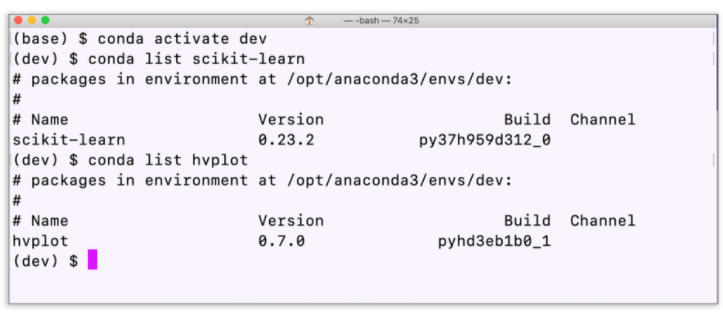

# Crypto_Clusters
Create a Jupyter Notebook that clusters cryptocurrencies by their performance in different time periods. Then plot the results to visually show the performance of each cryptocurrency portfolio.

---

## Technologies

This project leverages python 3.7 with the following packages:

**[Pandas Library](https://pandas.pydata.org/)** - a fast, powerful, flexible and easy to use open source data analysis and manipulation tool.<br>

**[HVPlot Library](https://hvplot.holoviz.org/)** - A high-level plotting API for the PyData ecosystem built on HoloViews.<br>

**[Pathlib Library](https://pathlib.readthedocs.io/en/pep428/)** - offers a set of classes featuring all the common operations on paths in an easy, object-oriented way.<br>

**[SKLearn.cluster Library](https://scikit-learn.org/stable/modules/clustering.html)** - Clustering of unlabeled data can be performed with the module sklearn.cluster.<br>

**[SKLearn.decomposition Library](https://scikit-learn.org/stable/modules/generated/sklearn.decomposition.PCA.html)** - Principal component analysis (PCA) - Linear dimensionality reduction using Singular Value Decomposition of the data to project it to a lower dimensional space.<br>

**[SKLearn.preprocessing Library](https://scikit-learn.org/stable/modules/generated/sklearn.preprocessing.StandardScaler.html)** - StandardScalar - Standardize features by removing the mean and scaling to unit variance.<br>

---

## Installation Guide

Before running the application first install the following dependencies:

In this application, you’ll use JupyterLab and the following Python libraries:

scikit-learn

hvPlot

The scikit-learn library is automatically installed with Anaconda.

### Confirm the scikit-learn and hvPlot Installations

To check that scikit-learn and hvPlot are installed in your Conda dev environment, complete the following steps.

1. Activate your Conda dev environment (if it isn’t already) by running the following in your terminal:

```python
conda activate dev
```

2. When the environment is active, run the following in your terminal:

```python
conda list scikit-learn
conda list hvplot
```

If the scikit-learn and hvPlot libraries are installed on your machine, your terminal will display the following:



If you see scikit-learn and hvPlot listed in the terminal, you’re all set!

### Install scikit-learn

If your terminal does not display scikit-learn and you need to install it, run the following:

```python
pip install -U scikit-learn
```

When the installation is complete, return to Step 2 in the previous section to verify the installation.

### Install hvPlot

If you need to install the hvPlot library, run the following in your terminal:

```python
conda install -c pyviz hvplot
```

When the installation is complete, return to Step 2 in the previous section to verify the installation.

You're now all set up! 